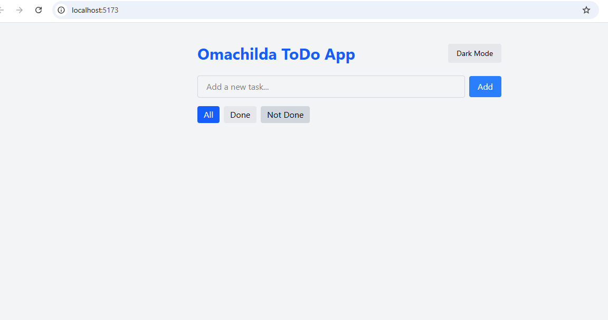
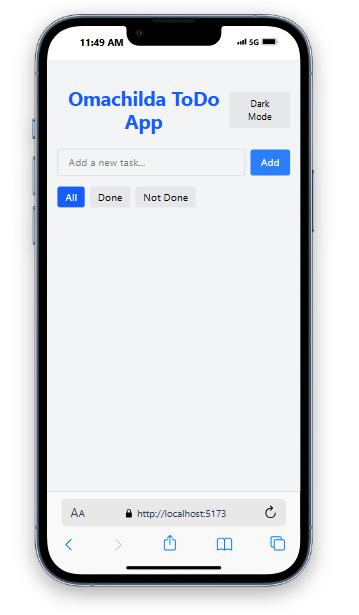

# 📋 ToDo App with Redux + Tailwind + Dark Mode

A clean and animated ToDo Application built with **React**, **Redux Toolkit**, **Tailwind CSS**, and **Framer Motion**. Users can add, edit, filter, and manage tasks with a dark/light theme toggle.

---

## 🚀 Features

- ✅ Add a new task
- 📝 Edit an existing task
- 📂 Filter tasks by status: All, Done, Not Done
- 🌙 Toggle dark/light mode
- ✨ Smooth animations using **Framer Motion**
- 🔄 Redux Toolkit for global state management
- 🎨 Tailwind CSS for responsive, clean styling

---

## 📦 Tech Stack

- [React](https://reactjs.org/)
- [Vite](https://vitejs.dev/)
- [Tailwind CSS](https://tailwindcss.com/)
- [Redux Toolkit](https://redux-toolkit.js.org/)
- [React Redux](https://react-redux.js.org/)
- [Framer Motion](https://www.framer.com/motion/)

---

## 📁 Folder Structure

src/
├── components/
│ ├── AddTask.jsx
│ ├── ListTask.jsx
│ └── Task.jsx
├── redux/
│ ├── store.js
│ └── taskSlice.js
├── App.jsx
├── index.css
└── main.jsx

src/
├── components/
│ ├── AddTask.jsx
│ ├── ListTask.jsx
│ └── Task.jsx
├── redux/
│ ├── store.js
│ └── taskSlice.js
├── App.jsx
├── index.css
└── main.jsx


---

## 🔧 Installation

1. **Clone the repo**
   ```bash
   git clone https://github.com/omasleek/redux-project.git
   
   ## 📸 Screenshots

###  desktop Mode


###  Mobile Mode

